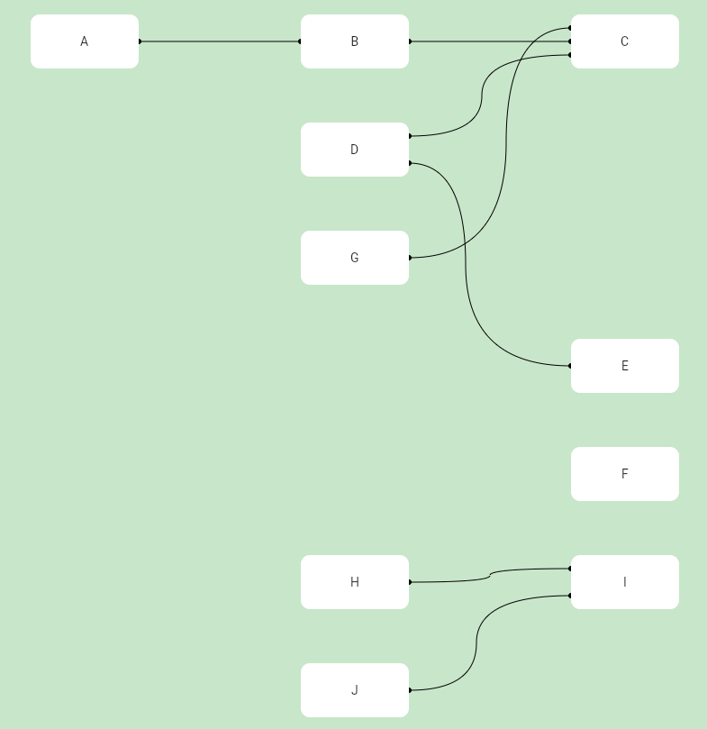

# Flutter Network Graph

This project is a simple solution to draw directed acyclic forests into a clean and structured view.

## Features

 - Model the graph by adding nodes and edges
 - Flutter Network Graph will create a layout automatically
 - onClick and onHover callbacks

## Examples

    List<Node<String>> nodes = [
        Node<String>([], "A"),
        Node<String>(["A"], "B"),
        Node<String>(["B", "D", "G"], "C"),
        Node<String>([], "D"),
        Node<String>(["D"], "E"),
        Node<String>([], "F"),
        Node<String>([], "G"),
        Node<String>([], "H"),
        Node<String>([], "J"),
        Node<String>(["H", "J"], "I"),
    ];

    Graph<String> graph = Graph<String>(nodes);

    ...

    NetworkView(
        graph: graph,
        settings: GraphSettings(
          backgroundColor: Colors.green[100]!,
        ),
        nodeBuilder: (Node node) => Container(
          decoration: const BoxDecoration(
            color: Colors.white,
            borderRadius: BorderRadius.all(Radius.circular(10)),
          ),
          alignment: Alignment.center,
          width: double.infinity,
          height: double.infinity,
          child: Text(node.label),
        ),
    ),

